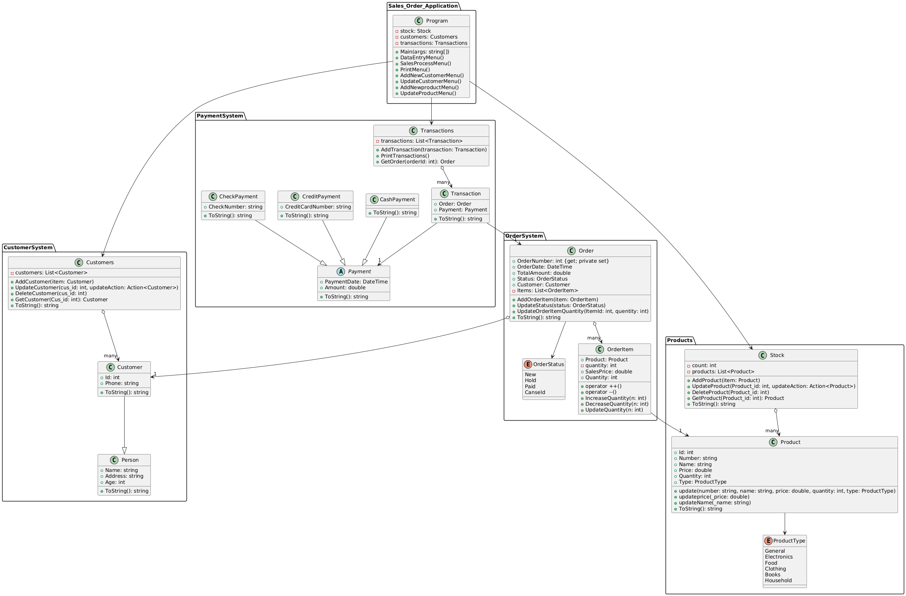

# Sales Order Management System

##  Overview
The **Sales Order System** is a console-based C# application built for an Object-Oriented Programming (OOP) assignment. It simulates a retail sales workflow, allowing users to manage customers, stock, orders, and payments. It follows core OOP principles such as abstraction, encapsulation, inheritance, and polymorphism, and utilizes features like operator overloading and class hierarchies.

---

## 🚀 Features
### Data Entry:
- Add, update, and delete customer records.
- Add, update, and delete products in stock.
### Sales Process:
- Add transactions.
- Update orders.
- Process payments.
### Print:
- Print customer details.
- Print stock inventory.
- Print transaction records.
---

##  Project Structure
The project is organized into the following namespaces and key files:
- **CustomerSystem**:
  - `Person.cs`: Base class for customer details (name, address, age).
  - `Customer.cs`: Extends `Person` with ID and phone.
  - `Customers.cs`: Manages a list of customers with add, update, and delete operations.
- **Products**:
  - `Product.cs`: Defines product details and update methods.
  - `Stock.cs`: Manages a list of products with add, update, and delete operations.
- **OrderSystem**:
  - `Order.cs`: Manages orders with order number, date, status, customer, and items.
  - `OrderItem.cs`: Represents items in an order with quantity adjustments and operator overloading.
- **PaymentSystem**:
  - `Payment.cs`: Abstract base class for payments (cash, credit, check).
  - `Transaction.cs`: Links orders with payments and manages transaction records.
- **Sales_Order_Application**:
  - `Program.cs`: Main entry point with a console-based menu for user interaction.

## UML Digram 


## Setup Instructions
1. **Prerequisites**:
   - .NET SDK (version 6.0 or later recommended).
   - A C# IDE (e.g., Visual Studio, Visual Studio Code, or Rider).
2. **Clone the Repository**:
   ```bash
   git clone https://github.com/Omda777/sales-order-system.git
   cd sales-order-system
   ```

